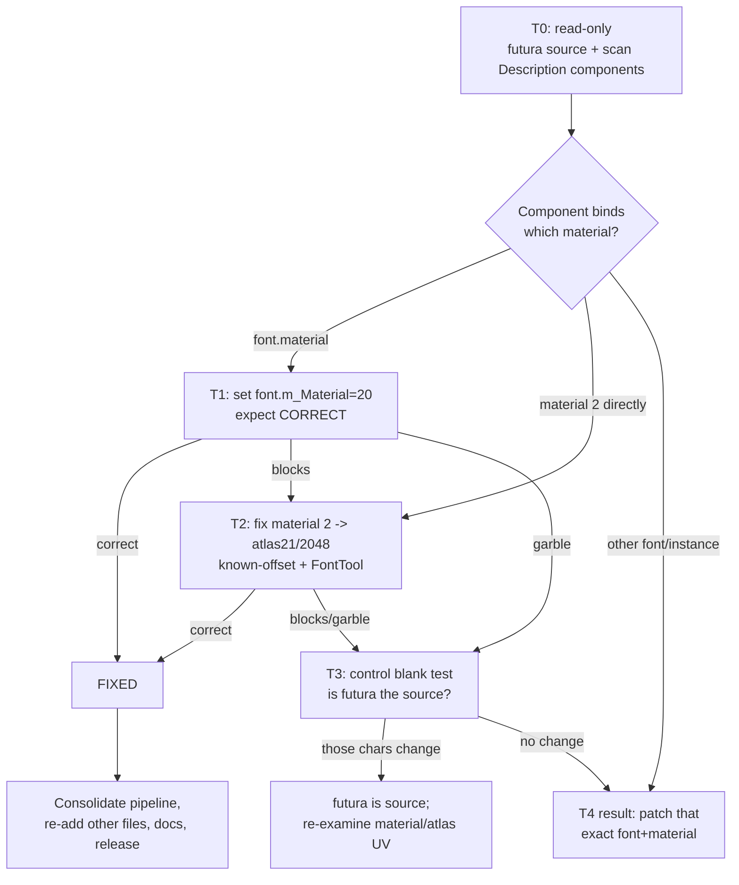

# Description-Text Font — Root-Cause Investigation Plan

**Scope:** Only the campaign/crusade/army/unit-card **description body text** is
broken. All other UI (menus, faction names, unit stats, buttons, tooltips,
launcher) renders **perfect Traditional Chinese** and is DONE. This document is a
disciplined, hypothesis-driven plan to isolate and fix the description-text
rendering — no more blind build/test loops.

**Golden rule for every build from now on:** state the *hypothesis*, the *single
variable changed*, and *what each possible outcome proves*. A test that cannot
narrow the root cause regardless of result must not be built.

---

## 1. Project context

- Game: **Warhammer 40,000: Battlesector 1.7.7** (Unity `6000.0.62f1`, IL2CPP).
- Mod: SC→TC localization. Text lives in `resources.assets` as TextAssets; the mod
  converts the Chinese slot SC→TC (proven, byte-identical). Fonts are TMP
  (TextMeshPro) SDF assets across `sharedassets0/1.assets` and two StreamingAssets
  bundles (`startup`, `mapbuilder`).
- Delivery: **Vortex ZIP only** (deployment confirmed working — deployed file
  hashes match our builds; our edits take effect in-game).

### 1.4 → 1.7.7 delta (relevant to fonts)
| Aspect | 1.7.4 | 1.7.7 |
|---|---|---|
| Loc architecture | TextRepository TextAssets | **unchanged** |
| Description font | `futura … No Underlay` (dynamic) | same, but dynamic gen now emits **garbage** not tofu |
| Old symptom | **tofu (□)** | **garble (wrong glyphs 川/屹/眉) + some tofu** |

The old→new symptom change (tofu → garble) is the central clue: something in 1.7.7
now *produces* wrong glyphs for CJK codepoints instead of failing to tofu.

---

## 2. Ground-truth facts (verified, not assumed)

- **F1.** Game `Player-*.log` explicitly names it: text object **`[Description]`**,
  font **`futura medium condensed bt SDF - No Underlay`** = `sharedassets1` **pid 3646**.
- **F2.** futura (3646) is **dynamic** (`m_AtlasPopulationMode=1`), 124 Latin chars,
  0 CJK, fallback table `[(0,3644), (5→sharedassets0, 782), (0,3645=Roboto)]`.
- **F3.** Deployed `sharedassets1` **pid 3644** (futura's 1st fallback) has **full TC**
  (2986 cjk incl 並/亂/來), `pop=0`, atlas texture **pid 21** (2048², Alpha8, in
  `sharedassets1.assets.resS`), material **pid 20** (`_MainTex=21`, `_TexW/H=2048`).
- **F4.** futura's own material is **pid 2** (`_MainTex=22`, futura's old 1024² atlas).
- **F5.** Deployment works; our changes to `sharedassets1` reach the game.
- **F6.** All *other* CJK fonts were patched full+static with **no effect** on
  `[Description]`: `sharedassets0` 782/783, `startup` Generated/No-Underlay,
  `mapbuilder` Noto, `resources` default-fallback 219. → the description resolves
  **only** through futura (3646) and its chain, confirming F1.

---

## 3. TMP rendering-pipeline model (how a glyph reaches the screen)

For each character in `[Description]` (font = futura 3646):
```
1. Look up char in futura.m_CharacterTable
   ├─ found → glyph = futura.m_GlyphTable[idx]; atlas rect from futura.m_AtlasTextures
   └─ not found →
2.   If futura is DYNAMIC → try runtime-rasterize from futura.m_SourceFontFile
        ├─ success → new glyph (WRONG if source lacks/mismaps the CJK) ── GARBLE
        └─ fail → 
3.        Walk fallback table [3644, 782, 3645]
             ├─ found in 3644 → glyph from 3644 (atlas 21)
             └─ none → missing-glyph □ ── TOFU
4. RENDER: sample the resolving font's MATERIAL._MainTex at the glyph's atlas UV,
   using MATERIAL._TextureWidth/Height for SDF scaling.
```
**Critical:** rendering uses the **material's** `_MainTex` + `_TexW/H`, which must
match the atlas the glyph rect belongs to. A font/material atlas mismatch →
**solid blocks** (SDF samples an atlas region with no glyph → constant value).

---

## 4. Observation state machine (every change → outcome → what it proved)

| # | Change (single variable) | Outcome | What it PROVED |
|---|---|---|---|
| S0 | Vanilla fonts + TC text | Garble + some tofu | Description font lacks TC; dynamic gen active |
| S1 | futura(3646) `pop=1→0` (keep 124 table + fallback) | **Still garble** | Static-with-fallback did NOT route to 3644 ⇒ *either* it wasn't deployed as expected *or* TMP didn't consult fallback *or* the render still used a bad material/atlas. **UNRESOLVED — see H1.** |
| S2 | futura mirrors 3644 tables+atlas(21), material still pid 2 (atlas22/1024) | **Solid white blocks** | Char resolved in futura (mirrored) → glyph rect from atlas 21, but render sampled **material 2 → atlas 22/1024**. ⇒ **[Description] uses futura's OWN material (pid 2)**, and glyphs come from futura's table. |
| S3 | S2 + material 2 → atlas21/2048 via **UnityPy full-save** | Garble/tofu | Ambiguous: likely **UnityPy Unity-6 `.assets` full-save corruption** (memory-documented risk). Not a clean logic test. |
| S4 | futura mirrors 3644 + `m_Material`→pid 20; **FontTool-only** | **PENDING** | See test T1 below. |

**Biggest single deduction (from S2):** the description renders with **futura's
glyph table + futura's material**. So the two things that must both be correct are
(a) futura's glyph/atlas data and (b) futura's *material's* `_MainTex`/`_TexW/H`.

---

## 5. Open hypotheses (unclear behaviors to kill one-by-one)

- **H1 — Why did S1 (futura static) still garble?**
  Candidates: (a) TMP still ran dynamic gen because `m_SourceFontFile` present;
  (b) the render used material 2 with futura's *old atlas 22* which had stale/no
  CJK → garble; (c) fallback simply isn't consulted for this component.
- **H2 — Does `[Description]` use `font.material` or a directly-serialized material
  reference?** S2 proved *a* material (pid 2) was used. If the component's
  `m_fontSharedMaterial` is serialized to pid 2, then changing `font.m_Material`
  (S4) will NOT change what's sampled → S4 would show **blocks** again.
- **H3 — Is futura's `m_SourceFontFile` a CJK font in 1.7.7 (explaining garble vs
  old tofu)?** Not yet inspected.
- **H4 — Are there multiple `[Description]`-style text components using different
  materials/font instances?**

---

## 6. Test matrix (each test isolates ONE variable; outcomes are diagnostic)

Every test is FontTool-only (never UnityPy full-save on `.assets` — S3 corruption).

### T1 — Does the component use `font.material`? (validates S4)
- **Change:** futura mirrors 3644 (atlas 21) + `font.m_Material → pid 20` (correct
  material). Material 2 left untouched (still atlas 22/1024).
- **Why:** distinguishes H2. Only `font.material` changed; material 2 unchanged.
- **Outcomes:**
  - **Correct TC** → component uses `font.material`; **FIXED**.
  - **Solid blocks** → component references **material 2 directly** (H2 confirmed);
    go to T2.
  - **Garble/tofu** → glyphs not resolving from futura at all; go to T3.

### T2 — Fix futura's own material (pid 2) surgically (if T1 = blocks)
- **Change:** set material **pid 2** `_MainTex→21`, `_TexW/H→2048`, via a **known-
  offset** edit (compute exact byte offsets from the TMP/Material typetree, not a
  blind search) + FontTool raw-replace. Keep futura `m_Material=2`.
- **Why:** if the component is bound to material 2, material 2 must sample atlas 21.
- **Outcomes:** Correct → FIXED. Blocks/garble → material offsets wrong or H4;
  re-derive offsets / enumerate components (T4).

### T3 — Prove futura glyph resolution with a control (if T1 = garble)
- **Change:** blank futura's atlas region for a few specific baked TC codepoints
  (e.g., make 並/亂 render as a solid box) while leaving neighbors intact.
- **Why:** deterministic control — if exactly those chars change, futura's table IS
  the source; if nothing changes, a *different* font/instance renders it (H4).

### T4 — Enumerate `[Description]` components (if H4 suspected)
- **Action (read-only):** find all `TextMeshProUGUI` MonoBehaviours whose
  GameObject/name is `Description`; read their `m_font`/`m_fontSharedMaterial`
  PPtrs to see the exact font + material each uses.
- **Why:** removes all guesswork about which font/material the game binds. This is
  the definitive answer and should arguably be done **before** T1/T2.

### T0 (do FIRST) — Inspect futura's source + the component binding
- **Action (read-only, no build):**
  1. Read futura(3646) `m_SourceFontFileGUID`/`m_SourceFontFile` (H3).
  2. Do T4's component scan to learn the real font+material binding (H2/H4).
- **Why:** these two read-only checks likely collapse the whole tree — they tell us
  whether the fix belongs on the font, the material, or the component, *before*
  any build.

---

## 7. Decision flow



---

## 8. Rules learned (constraints for all future work)
- **Never** `UnityPy env.file.save()` on Unity-6 `.assets` (corrupts — S3). Use the
  C# **FontTool** (AssetsTools.NET raw-replace) for `.assets`; UnityPy
  `env.file.save(packer="original")` is OK for **bundles** only.
- Rendering depends on the **material** (`_MainTex`, `_TextureWidth/Height`), not
  just the font's `m_AtlasTextures` — always fix both together.
- The game's `Player.log` DOES name the failing font + text object — use it.
- Deployment via Vortex works; verify by hashing the deployed file when in doubt.

---

## 9. Immediate next action
Execute **T0** (two read-only inspections: futura's source font GUID, and a scan of
all `Description` TMP components' font+material PPtrs). Report findings, update the
flow, and only then choose T1/T2/T4. No build until T0 tells us where the fix lives.
